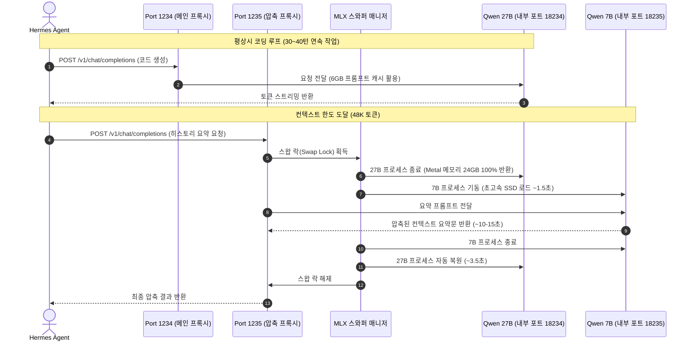

# MLX Dynamic Model Swapper (mlx-dynamic-swapper)

[한국어](#-소개) | [English Version](#-english-version)

---

## 🇰🇷 한국어

### 💡 소개

> **Apple Silicon / Mac Studio (MLX)를 위한 무중단 동적 LLM 메모리 스왑 프록시**  
> Mac Studio M5 Max (36GB 통합 메모리) 환경에서 **27B 메인 코딩 모델**과 **7B 컨텍스트 압축 전용 모델**을 메모리 초과(OOM) 없이 교대로 실행하는 고성능 프록시입니다.

---

### 🧐 왜 만들었는가?

Apple Silicon의 통합 메모리 구조(Unified Memory)는 강력하지만, 36GB 기본 모델에서는 대형 모델 복수 구동 시 명확한 물리적 한계가 존재합니다:

- **메인 코딩 모델 (Qwen 27B 4-bit)**: 가중치 ~18GB + 프롬프트 캐시 ~6GB = **약 24GB 점유**
- **보조 압축 요약 모델 (Qwen 7B 4-bit)**: 가중치 **약 5GB 점유**
- **동시 실행 시**: 24GB + 5GB + macOS 시스템 기본 = **33~35GB 이상 ➔ 심각한 메모리 압박, Swap 발생 및 커널 패닉/OOM 크래시**

그러나 에이전트(Hermes Agent 등)의 실제 동작 특성을 분석해보면:
1. **두 모델이 같은 순간에 동시에 추론할 필요가 전혀 없습니다.**
2. 메인 에이전트가 코딩 작업을 하다가 컨텍스트가 임계값(예: 48K 토큰)에 도달할 때만 **단 1회** 보조 모델에게 요약을 위임합니다.
3. **MLX Dynamic Swapper**는 두 개의 영구 OpenAI 호환 엔드포인트를 노출합니다:
   - **Port 1234**: 메인 27B 코딩 모델 프록시 (6GB KV 캐시 상시 유지)
   - **Port 1235**: 컨텍스트 압축 전용 7B 모델 프록시
4. **Port 1235**로 요약 요청이 들어오면:
   - 27B 모델 프로세스를 안전하게 종료하여 **Metal 메모리를 0.5초 만에 100% 반환**.
   - 36GB 전체 메모리를 온전히 활용해 **7B 모델을 1.5초 만에 기동**, 고품질 요약 수행 (~10-15초).
   - 요약이 끝나면 7B를 내리고 **27B 모델을 원래 상태로 즉시 복원**.

---

### 🔄 동작 아키텍처 (Architecture Flow)



---

### ✨ 주요 기능

- **메탈 메모리 완벽 회수 (Zero Memory Leak)**: `os.killpg` 기반 프로세스 그룹 정리로 macOS Metal VRAM을 100% 깔끔하게 반환.
- **항시 대기 OpenAI 호환 엔드포인트**:
  - `http://127.0.0.1:1234/v1` (메인 모델)
  - `http://127.0.0.1:1235/v1` (압축 요약 모델)
- **초고속 스왑**: Apple Silicon의 초고속 NVMe 읽기 속도 덕분에 7B 로딩 약 1.5초, 27B 로딩 약 3.5초 소요.
- **macOS LaunchAgent 백그라운드 상주**: 부팅 시 자동으로 서비스가 시작되며 크래시 시 자동 복구.
- **간편한 통합 CLI (`mlx`)**:
  - `mlx status`: 활성 모델, 실제 점유 메모리(RAM), PID, 프록시 상태 한눈에 확인.
  - `mlx logs`: 실시간 스왑 및 추론 로그 스트리밍.
  - `mlx start` / `mlx stop` / `mlx restart`: 간편한 데몬 제어.

---

### 🚀 설치 및 사용법 (Quick Start)

#### 1. 요구 사항
- Apple Silicon Mac (M1/M2/M3/M4/M5 Max/Ultra 권장)
- Python 3.10 이상
- 필수 패키지: `mlx-lm`, `fastapi`, `uvicorn`, `httpx`

#### 2. 설치
```bash
git clone https://github.com/deokgoo/mlx-dynamic-swapper.git
cd mlx-dynamic-swapper
chmod +x install.sh bin/mlx
./install.sh
```

#### 3. CLI 명령어
```bash
# 실행 상태 및 활성 모델 확인
mlx status

# 실시간 스왑 로그 확인
mlx logs

# 데몬 재시작 및 중지
mlx restart
mlx stop
```

---

### ⚙️ 환경 설정 (Configuration)

환경 변수 또는 `mlx_manager.py` 상단 설정값을 통해 원하는 모델과 경로로 커스텀할 수 있습니다:

| 환경 변수 | 기본값 | 설명 |
| :--- | :--- | :--- |
| `PYTHON_BIN` | `~/.mlx-server/bin/python` | `mlx_lm`이 설치된 Python 가상환경 경로 |
| `MODEL_MAIN_PATH` | `~/.mlx-models/Qwen3.8-27B-4bit` | 메인 코딩 모델 경로 |
| `MODEL_COMPACT_PATH` | `~/.mlx-models/Qwen2.5-7B-Instruct-4bit` | 보조 컨텍스트 압축 모델 경로 |
| `PROXY_PORT_MAIN` | `1234` | 메인 모델 외부 OpenAI 프록시 포트 |
| `PROXY_PORT_COMPACT` | `1235` | 압축 모델 외부 OpenAI 프록시 포트 |
| `PROMPT_CACHE_BYTES` | `6GB` | 메인 모델용 KV 프롬프트 캐시 할당량 |

---

### 🤝 Hermes Agent 연동 가이드

`~/.hermes/config.yaml`에 아래와 같이 구성하면 **인간의 개입이 전혀 필요 없는 100% 로컬 무중단 에이전트 환경**이 완성됩니다:

```yaml
model:
  default: "/Users/deokgoo/.mlx-models/Qwen3.8-27B-4bit"
  provider: "mlx"
  base_url: "http://127.0.0.1:1234/v1"
  context_length: 65536

providers:
  mlx:
    base_url: "http://127.0.0.1:1234/v1"
    extra_body:
      max_tokens: 8192
  mlx_compaction:
    base_url: "http://127.0.0.1:1235/v1"
    extra_body:
      max_tokens: 4096

compression:
  enabled: true
  threshold_tokens: 48000   # 48K 도달 시 자동 압축 발동 (30~40턴 연속 작업 버퍼)
  target_ratio: 0.20
  protect_last_n: 10        # 최근 5턴 보존
  proactive_prune_tokens: 32000 # 무거운 터미널 로그 무비용 사전 정리

auxiliary:
  compression:
    provider: "mlx_compaction"
    model: "/Users/deokgoo/.mlx-models/Qwen2.5-7B-Instruct-4bit"
    reasoning_effort: "none"
    extra_body:
      chat_template_kwargs:
        enable_thinking: false
```

---

<br/>

## 🇺🇸 English Version

### 💡 Overview

> **Zero-OOM Dynamic LLM Swapping Proxy for Apple Silicon / Mac Studio (MLX)**  
> Run a massive **27B main coding model** and a dedicated **7B compaction model** sequentially on unified memory without exceeding hardware limits.

---

### 💡 Why This Exists

On Apple Silicon Macs (such as Mac Studio M5 Max with 36GB Unified Memory), running large local LLMs poses a strict VRAM ceiling:
- **Main Coding Model (Qwen 27B 4-bit)**: ~18GB VRAM + ~6GB Prompt Cache = **~24GB**.
- **Auxiliary Compaction Model (Qwen 7B 4-bit)**: ~5GB VRAM.
- **Combined concurrently**: 24GB + 5GB + OS Overhead = **> 33-35GB** ➔ **Memory Pressure / Swapping / OOM crashes**.

However, in an agentic coding workflow (like [Hermes Agent](https://github.com/NousResearch/Hermes-Agent)):
1. **You do NOT need both models running at the same time.**
2. When the main agent hits the context compression threshold (e.g. 48K tokens), it delegates summarization to an auxiliary model.
3. **MLX Dynamic Model Swapper** exposes two permanent OpenAI-compatible proxy ports:
   - **Port 1234**: Main 27B Coding Model Proxy (with 6GB prompt cache)
   - **Port 1235**: Compaction 7B Model Proxy
4. When a compaction request arrives on **Port 1235**:
   - The swapper automatically **stops the 27B model** (`SIGTERM`), releasing **100% of Metal memory** in <0.5s.
   - Starts the **7B model** on full VRAM to summarize in ~10-15s.
   - Upon completion, unloads the 7B model and **restores the 27B model** seamlessly.

---

### 🛠 Features

- **Sequential Zero-Leak VRAM Management**: Automatically unloads and terminates processes using `os.killpg` to guarantee Metal unified memory is completely reclaimed.
- **Permanent OpenAI-Compatible Endpoints**:
  - `http://127.0.0.1:1234/v1` (Main Model)
  - `http://127.0.0.1:1235/v1` (Compaction Model)
- **Fast Startup**: Models load from ultra-fast Apple Silicon NVMe SSD in ~1.5s (7B) to ~3.5s (27B).
- **macOS LaunchAgent Support**: Runs automatically as a background service via `launchd`.
- **Integrated CLI Tool (`mlx`)**:
  - `mlx status`: View active model, RAM usage, PID, and proxy health.
  - `mlx logs`: Real-time streaming log monitor.
  - `mlx start` / `mlx stop` / `mlx restart`: One-command control.

---

### 🚀 Quick Start

#### 1. Requirements
- macOS with Apple Silicon (M1/M2/M3/M4/M5 Max/Ultra)
- Python 3.10+
- `mlx-lm`, `fastapi`, `uvicorn`, `httpx`

#### 2. Installation
```bash
git clone https://github.com/deokgoo/mlx-dynamic-swapper.git
cd mlx-dynamic-swapper
chmod +x install.sh bin/mlx
./install.sh
```

#### 3. CLI Usage
```bash
# Check running status and active model
mlx status

# Stream live swap and inference logs
mlx logs

# Stop or restart the background daemon
mlx restart
mlx stop
```

---

### ⚙️ Configuration

Set custom environment variables in your shell or update `mlx_manager.py`:

| Variable | Default | Description |
| :--- | :--- | :--- |
| `PYTHON_BIN` | `~/.mlx-server/bin/python` | Path to python environment with `mlx_lm` installed |
| `MODEL_MAIN_PATH` | `~/.mlx-models/Qwen3.8-27B-4bit` | Path to main coding model |
| `MODEL_COMPACT_PATH` | `~/.mlx-models/Qwen2.5-7B-Instruct-4bit` | Path to auxiliary compaction model |
| `PROXY_PORT_MAIN` | `1234` | External OpenAI proxy port for main model |
| `PROXY_PORT_COMPACT` | `1235` | External OpenAI proxy port for compaction model |
| `PROMPT_CACHE_BYTES` | `6GB` | KV Prompt Cache reservation for main model |

---

## 📜 License

MIT License. Free to use, adapt, and build upon.
