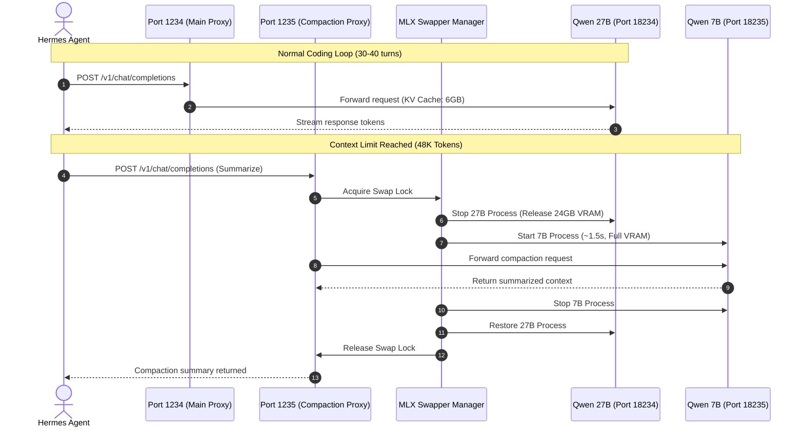

# MLX Dynamic Model Swapper (mlx-dynamic-swapper)

> **Zero-OOM Dynamic LLM Swapping Proxy for Apple Silicon / Mac Studio (MLX)**  
> Run a massive 27B main coding model and a dedicated 7B compaction model sequentially on unified memory without exceeding hardware limits.

---

## 💡 Why This Exists

On Apple Silicon Macs (such as Mac Studio M5 Max with 36GB Unified Memory), running large local LLMs poses a strict VRAM ceiling:
- **Main Coding Model (Qwen 27B 4-bit)**: ~18GB VRAM + ~6GB Prompt Cache = **~24GB**.
- **Auxiliary Compaction Model (Qwen 7B 4-bit)**: ~5GB VRAM.
- **Combined concurrently**: 24GB + 5GB + OS Overhead = **> 33-35GB** ➔ **Memory Pressure / Swapping / OOM crashes**.

However, in an agentic coding workflow (like [Hermes Agent](https://github.com/NousResearch/Hermes-Agent)):
1. **You do NOT need both models running at the same time.**
2. When the main agent hits the context compression threshold (e.g. 48K tokens), it delegates summarization to an auxiliary model.
3. **MLX Dynamic Model Swapper** exposes two permanent OpenAI-compatible proxy ports:
   - **Port 1234**: Main 27B Coding Model Proxy (with 6GB prompt cache)
   - **Port 1235**: Compaction 7B Model Proxy
4. When a compaction request arrives on **Port 1235**:
   - The swapper automatically **stops the 27B model** (`SIGTERM`), releasing **100% of Metal memory** in <0.5s.
   - Starts the **7B model** on full VRAM to summarize in ~10-15s.
   - Upon completion, unloads the 7B model and **restores the 27B model** seamlessly.



---

## 🛠 Features

- **Sequential Zero-Leak VRAM Management**: Automatically unloads and terminates processes using `os.killpg` to guarantee Metal unified memory is completely reclaimed.
- **Permanent OpenAI-Compatible Endpoints**:
  - `http://127.0.0.1:1234/v1` (Main Model)
  - `http://127.0.0.1:1235/v1` (Compaction Model)
- **Fast Startup**: Models load from ultra-fast Apple Silicon NVMe SSD in ~1.5s (7B) to ~3.5s (27B).
- **macOS LaunchAgent Support**: Runs automatically as a background service via `launchd`.
- **Integrated CLI Tool (`mlx`)**:
  - `mlx status`: View active model, RAM usage, PID, and proxy health.
  - `mlx logs`: Real-time streaming log monitor.
  - `mlx start` / `mlx stop` / `mlx restart`: One-command control.

---

## 🚀 Quick Start

### 1. Requirements
- macOS with Apple Silicon (M1/M2/M3/M4/M5 Max/Ultra)
- Python 3.10+
- `mlx-lm`, `fastapi`, `uvicorn`, `httpx`

### 2. Installation
Clone the repository and run `install.sh`:

```bash
git clone https://github.com/deokgoo/mlx-dynamic-swapper.git
cd mlx-dynamic-swapper
chmod +x install.sh bin/mlx
./install.sh
```

### 3. CLI Usage

```bash
# Check running status and active model
mlx status

# Stream live swap and inference logs
mlx logs

# Stop or restart the background daemon
mlx restart
mlx stop
```

---

## ⚙️ Configuration

Set custom environment variables in your shell or update `mlx_manager.py`:

| Variable | Default | Description |
| :--- | :--- | :--- |
| `PYTHON_BIN` | `~/.mlx-server/bin/python` | Path to python environment with `mlx_lm` installed |
| `MODEL_MAIN_PATH` | `~/.mlx-models/Qwen3.8-27B-4bit` | Path to main coding model |
| `MODEL_COMPACT_PATH` | `~/.mlx-models/Qwen2.5-7B-Instruct-4bit` | Path to auxiliary compaction model |
| `PROXY_PORT_MAIN` | `1234` | External OpenAI proxy port for main model |
| `PROXY_PORT_COMPACT` | `1235` | External OpenAI proxy port for compaction model |
| `PROMPT_CACHE_BYTES` | `6GB` | KV Prompt Cache reservation for main model |

---

## 🤝 Hermes Agent Integration

In `~/.hermes/config.yaml`:

```yaml
model:
  default: "/Users/deokgoo/.mlx-models/Qwen3.8-27B-4bit"
  provider: "mlx"
  base_url: "http://127.0.0.1:1234/v1"
  context_length: 65536

providers:
  mlx:
    base_url: "http://127.0.0.1:1234/v1"
    extra_body:
      max_tokens: 8192
  mlx_compaction:
    base_url: "http://127.0.0.1:1235/v1"
    extra_body:
      max_tokens: 4096

compression:
  enabled: true
  threshold_tokens: 48000
  target_ratio: 0.20
  protect_last_n: 10
  proactive_prune_tokens: 32000

auxiliary:
  compression:
    provider: "mlx_compaction"
    model: "/Users/deokgoo/.mlx-models/Qwen2.5-7B-Instruct-4bit"
    reasoning_effort: "none"
    extra_body:
      chat_template_kwargs:
        enable_thinking: false
```

---

## 📜 License

MIT License. Free to use, adapt, and build upon.
